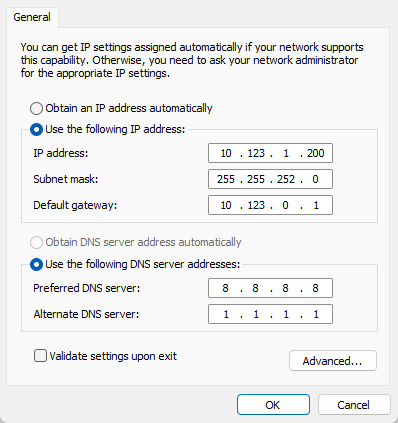
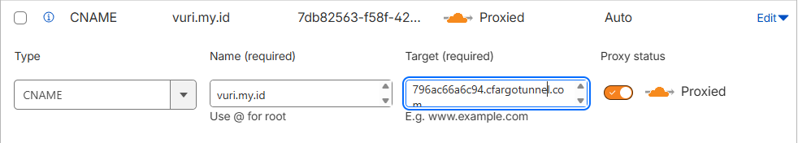

#   VURI
  1)  Fork/ clone git repository https://github.com/widyafebriandaru/vuri
 2)  Install docker dan docker compose versi baru
 3)  Lakukan ```docker-compose up --build -d```
 4)  Default portnya adalah 8502, 8501.
 5)  Input file excel yang berisikan data AHSP di 8501.
 
Contoh:
Kolom A     B       C       D       E       F
A.1 Gali    Gali    A.1     SE128   128A.1  item pekerjaan

 6)  Input lalu lakukan tes pencarian di 8502
 7)  Untuk forwarding IP dari Windows ke WSL:

    a)  Hapus dulu rule lama kalau ada
```netsh interface portproxy delete v4tov4 listenport=8502 listenaddress=0.0.0.0```

    b)  Buat port forwarding dari Windows ke IP WSL
```netsh interface portproxy add v4tov4 listenport=8502 listenaddress=0.0.0.0 connectport=8502 connectaddress=172.21.83.6```
    _(172.21.83.6) didapat dari "hostname -I" IP dari interface utama (eth0 / koneksi fisik_

     c)  Buat untuk semua portnya (8501)
```netsh interface portproxy add v4tov4 listenport=8502 listenaddress=0.0.0.0 connectport=8501 connectaddress=172.21.83.6```

 8) Buat firewall allow connection ke port yang digunakan
```netsh advfirewall firewall add rule name="Allow 8502" dir=in action=allow protocol=TCP localport=8502```
Cara manualnya:
    _- Windows firewall with advanced security -> Inbound rules -> New rules -> Port -> TCP (isi portnya) -> Allow Connection_

  9) Jangan lupa buat IP jadi static sesuai gateway wifi


 10) Tes ping/ buka aplikasi lewat device lain dalam satu wifi
 11) Selanjutnya cara menggunakan cloudflared tunnel secara gratis agar bisa pakai domain.
 12) Pertama beli domain dulu (yg murah bisa pakai "my.id")
 13) Daftar dan masuk cloud flare https://dash.cloudflare.com/
 14) Tambah domainnya di cloudflare (contoh: vuri.my.id), pilih free plan dan biarkan scan DNS.
 15) Setelah menambahkan domain, Cloudflare akan menampilkan dua nameserver unik, misalnya:
    ```mark.ns.cloudflare.com```
    ```sara.ns.cloudflare.com```
16) Masuk ke tempat beli domain, dan di nameserver ganti menjadi dua nameserver dari cloudflare. Tunggu beberapa menit, bahkan bisa sampai beberapa jam.
17) Cek di dashboard Cloudflare, jika ada status _Active_ berarti sudah bisa.
18) Masuk ke terminal linux, install cloudflare tunnel.
-   Instal Cloudflared
```sudo apt install cloudflared```
-   Login nanti akan dikasih link untuk verifikasi melalui browser.
```cloudflared tunnel login``` 
-   Buat tunnel dengan nama bebas
```cloudflared tunnel create vuri-tunnel```
Cloudflared akan memberikan file .json (biasanya disimpan di /home/{user}/.clouflared)Lalu Cloudflared juga akan memberikan ID tunnel. Simpan/ copy ID yang didapat.
19) Buat config.yml di folder .cloudflared (yang ada .json nya)
    
        cd ./home/{user}/.cloudflared
        touch config.yml
        nano config.yml
    

    Isi dengan:

    tunnel: 7db82563-f58f-4299-ac79-796ac66a6c94
    credentials-file: /home/febri/.cloudflared/7db82563-f58f-4299-ac79-796ac66a6c94.json

        ingress:
        - hostname: vuri.my.id
        service: http://localhost:8502
        - service: http_status:404
            

20)  Masuk ke web Cloudflare lagi, tambahkan DNS Record.
        
```Type    : CNAME
    Name    : @
    Content : {ID tunnel}{.cfargotunnel.com}
    Proxy Status : Pilih yang orange/ Proxied
```
Save

21) Langkah terkahir yaitu jalankan di terminal
```
cloudflared tunnel run vuri-tunnel
```
lalu cek apakah domain sudah aktif atau belum.    
